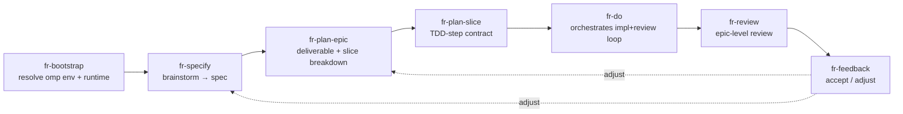

# Spec: Adapt Forward Roll to an omp-first, subagent-driven workflow

- **Status:** Draft, pending user review
- **Date:** 2026-07-16
- **Scope:** Pivot the Forward Roll plugin from Codex-first to oh-my-pi (omp) first, graft on the superpowers brainstorm→spec→plan→TDD-subagent+review loop, and keep the jj-first, epic→slice review posture.

## 1. Context

Forward Roll is a `jj`-first development-loop plugin. It currently ships as a **Codex plugin** (`plugins/forward-roll/.codex-plugin/plugin.json`) with seven skills — `fr-bootstrap`, `fr-specify`, `fr-plan-epic`, `fr-plan-slice`, `fr-do`, `fr-review`, `fr-feedback` — each backed by deterministic Python helpers. A `src/` authoring root generates `plugins/forward-roll/` via `build.py`. The repo already hosts omp structure: `.agents/skills/jj/` and `.agents/plugins/marketplace.json` (pointing at the generated plugin), but the skills themselves are still Codex-framed.

The goal is to (a) make the workflow **omp-first**, (b) add the superpowers discipline — a brainstorming step that produces a reviewed spec, then a subagent-driven red-green execution loop with a review gate — and (c) preserve the project's defining traits: jj review boundaries, epic→slice decomposition, and durable `.forward-roll/` artifacts.

## 2. Locked decisions

| Dimension | Decision | Rationale |
|---|---|---|
| Codex scope | **omp primary, Codex secondary** — build pipeline goes multi-target | "omp-first" without abandoning existing Codex users; cheap because `src/` already generates output. |
| Execution model | **Subagent-driven, non-isolated** — `task.isolation.mode: none`; the orchestrator owns the jj squash flow and gates the changeset on clean review | omp `task.isolation.mode` (`none`/`auto`/`rcopy`/`overlayfs`/`projfs`) plus the per-call `isolated: true` flag make shared-working-copy subagents deterministic. With `mode: none`, a subagent edits the parent's `@`. |
| Brainstorming | **Folded into `fr-specify`** as two phases (brainstorm → spec) | Keeps the skill set small; mirrors superpowers' deliberate two-step without a new skill. |
| Role encoding | **Custom omp task agents `fr-impl` + `fr-review`** | Reusable, consistent, schema-validated results; the TDD posture and spec-compliance review are workflow-specific and worth encoding. |

**Adaptation strategy: Approach A — restructure around the omp-first loop.** Reframe the skills to omp-native dispatch, add the two agents, take the build multi-target, and keep the deterministic helpers. (Rejected: B minimal overlay — leaves skills Codex-framed; C greenfield — discards the working build pipeline and helpers.)

## 3. Adapted workflow & skill set

The main omp session **is the orchestrator**; `fr-do` structures its dispatch of omp-native subagents. Python helpers remain deterministic artifact tools the orchestrator invokes inline.



| Skill | Change under omp-first |
|---|---|
| **fr-bootstrap** | Also verifies the omp environment: `task.isolation.mode: none` is effective; `fr-impl`/`fr-review` agents are discoverable; `jj` available. Still writes `.forward-roll/runtime.json`. |
| **fr-specify** | Gains a brainstorm phase (dialogue, 2–3 approaches, recommendation, converge on decisions) → spec phase (durable high-level specs). User-review gate between phases. |
| **fr-plan-epic** | Largely unchanged: one reviewable deliverable + slice breakdown + definition of done. Each slice entry references its TDD contract. |
| **fr-plan-slice** | Enriched: ordered red-green TDD steps + checkable acceptance criteria — the shared contract between `fr-impl` and `fr-review`. |
| **fr-do** | Becomes the orchestration skill: name the change, dispatch `fr-impl`, dispatch `fr-review`, loop on findings, `jj squash` into the described change only on clean review. |
| **fr-review** | Epic-scoped review at epic completion (complements the per-slice review inside `fr-do`). Dispatches the **`fr-review` subagent** across the epic's assembled changeset stack, passing the epic's definition-of-done + acceptance criteria as the contract. |
| **fr-feedback** | Largely unchanged: resolve review/operator feedback into one durable outcome (`accept`/`adjust-spec`/`adjust-epic`/`adjust-slice`/`queue-follow-up`). |

**Two-layer review (not redundant):** the per-slice `fr-review` *subagent* runs inside the `fr-do` loop and gates whether a changeset materializes; the `fr-review` *skill* runs at epic completion and dispatches the **same `fr-review` subagent** across the whole stack to judge the epic's definition-of-done.

## 4. The `fr-do` orchestration loop

Per slice, the orchestrator (main session) never writes code; it drives:

1. **Read** the slice artifact (goal, in/out scope, TDD steps, acceptance criteria, validation strategy, jj-shape, stop condition).
2. **Name the intention** — `jj describe` the intended review unit (the described parent); work will accumulate in the working-copy change `@`.
3. **Dispatch `fr-impl`** (non-isolated `task`) with the slice contract: implement red-green in the shared working copy. Edits land in `@`. It runs the slice validation set and returns a structured result.
4. **Dispatch `fr-review`** (non-isolated `task`) — validates the `@` change against slice acceptance + spec/epic intent + TDD coverage. Returns `verdict` + P0–P3 findings.
5. **Gate**
   - **clean** → orchestrator `jj squash`es `@` into the described change, appends the slice run-log via `do.py`, advances to the next slice.
   - **revise** → re-dispatch `fr-impl` with the findings (targeted fixes), re-review. Cap rounds per the slice's stop condition; escalate to the operator on exhaustion.

**Constraints**
- **Shared working copy ⇒ sequential slices.** Parallel impl subagents would clobber `@`. Parallelism is reserved for read-only `scout` research during planning.
- **jj history surgery is the orchestrator's alone.** Subagents never run `jj`.
- **Changeset gated on review.** Work in `@` only becomes a described, reviewable `jj` change after `fr-review` returns clean.

## 5. Custom agents (shipped on both targets)

Both build targets ship `fr-impl` and `fr-review`, each in its platform's native agent format, authored as separate sources under `src/agent-templates/`. **Bundling differs by platform:** omp bundles agents inside the plugin (`agents/*.md`, discovered on install/link); Codex plugins cannot bundle custom subagents (`plugin.json` has no `agents` field — confirmed against Codex's plugin docs), so Codex agents ship as repo-root `.codex/agents/*.toml` (project-scoped).

### Model resolution per platform
- **omp** — agents use role aliases resolved at runtime by the user's omp config + fallback chains: `fr-impl: @default`, `fr-review: @slow`. No literal slugs are baked in.
- **Codex** — agents **omit `model`** (each inherits the active Codex session model, or Codex auto-selects) and pin only `model_reasoning_effort`: `fr-impl: medium`, `fr-review: high`. This is the symmetric counterpart to omp's role-alias deferral — both defer concrete model resolution to the platform — and avoids baking stale OpenAI slugs into a fixed build artifact.

### fr-impl — TDD implementer
- **omp** (`agents/fr-impl.md`): frontmatter `tools: read, grep, glob, edit, write, bash, lsp, ast_grep` · `model: @default` · `spawns: ""` · `thinking-level: medium` · `output: { files_changed[], tests_written[], validation_result, scope_adherence, deviations[] }`. Body: TDD red-green; hyperfocus on the slice contract; never expand scope; run the slice validation set; leave work in `@`; **never run jj**; return the structured result.
- **Codex** (repo-root `.codex/agents/fr-impl.toml` — project-scoped, **not plugin-bundleable**): `model_reasoning_effort = "medium"` · `sandbox_mode = "workspace-write"` · `developer_instructions` carrying the same TDD posture.

### fr-review — spec-compliance reviewer
- **omp** (`agents/fr-review.md`): frontmatter `tools: read, grep, glob, bash, lsp, ast_grep, web_search` (read-only — no edit/write) · `model: @slow` · `spawns: scout` · `read-summarize: false` · `output: { verdict: ship|revise, findings[]{ priority 0–3, criterion, file_path, line_start, line_end }, acceptance_coverage, scope_check }`. Modeled on omp's bundled `reviewer` (P0–P3 + incremental-`yield` verdict) but oriented to slice acceptance + spec/epic intent + TDD coverage; reads `jj diff --git` and the slice/spec/epic artifacts.
- **Codex** (repo-root `.codex/agents/fr-review.toml` — project-scoped, **not plugin-bundleable**): `model_reasoning_effort = "high"` · `sandbox_mode = "read-only"` · `developer_instructions` carrying the same spec-compliance review posture.

## 6. fr-specify (brainstorm → spec) & plan enrichment

- **fr-specify, two phases.** *Brainstorm*: design dialogue (purpose/constraints/success, propose 2–3 approaches, recommend, converge) → short decisions artifact. *Spec*: durable high-level specs from converged decisions. User-review gate between phases. `specify.py` gains `--mode brainstorm` (scaffolds the decisions artifact); `describe`/`discover` consume it into the spec.
- **fr-plan-slice TDD contract.** Slice template gains an ordered **TDD steps** section (each step: behavior under test → expected impl) and checkable **acceptance criteria**. `plan_slice.py` template extended. This section is the contract `fr-impl` executes and `fr-review` checks.

## 7. Plugin structure & multi-target build

`src/` stays the single source of truth; `build.py` emits two targets.

```
src/
  skill-templates/fr-*/SKILL.md              # omp-first skill source
  agent-templates/fr-impl.omp.md            # NEW — omp agent (markdown + frontmatter)
  agent-templates/fr-impl.codex.toml        # NEW — Codex agent (TOML)
  agent-templates/fr-review.omp.md          # NEW
  agent-templates/fr-review.codex.toml      # NEW
  shared-scripts/resolve_context.py          # unchanged (shared across targets)
  plugin-shell/.omp-plugin/marketplace.json  # NEW — omp marketplace catalog source
  plugin-shell/.codex-plugin/plugin.json     # existing Codex manifest (secondary)
.omp-plugin/marketplace.json                 # GENERATED to repo root — catalog source: "./plugins/forward-roll"
plugins/forward-roll/                        # generated plugin bundle (dual-format)
  skills/fr-*/SKILL.md
  agents/fr-impl.md, fr-review.md             # omp custom task agents
  .codex-plugin/plugin.json                   # Codex secondary manifest
.agents/skills/jj/                           # project-level omp skill (unchanged)
.omp/config.yml                              # NEW — pins task.isolation.mode: none
.codex/agents/fr-impl.toml, fr-review.toml   # GENERATED to repo root — Codex agents (NOT plugin-bundleable)
```

- **Per-target skill deltas are small.** omp `fr-do` instructs native `task` dispatch of `fr-impl`/`fr-review`; the Codex variant dispatches the same two agents via Codex's subagent workflow. omp agents are bundled in the plugin; Codex agents are repo-root `.codex/agents/*.toml` (Codex plugins cannot bundle subagents). Deterministic Python helpers are shared across both targets.
- **`fr-bootstrap` verifies the omp precondition** — `task.isolation.mode: none` is effective and the agents are discoverable — so behavior is deterministic regardless of omp's isolation default. (Exact default to confirm in implementation: either already shared-working-copy, or we set `mode: none`.)
- **`plugin-build.json`** gains a targets concept: `omp` (marketplace catalog + skills + agents) and `codex` (`.codex-plugin/` + Codex-framed skills). `build.py` clears and regenerates per target.
- **Marketplace catalog location.** The omp catalog lives at repo-root `.omp-plugin/marketplace.json` (the valid location per omp docs — `.agents/plugins/` is not a recognized catalog root). Its `source: "./plugins/forward-roll"` points at the generated plugin bundle. The existing `.agents/plugins/marketplace.json` migrates to `.omp-plugin/marketplace.json`.
- **Local dogfooding.** To make the fr-* skills and the custom agents discoverable when running omp in this repo without installing the plugin, `omp plugin link ./plugins/forward-roll` (or the build mirrors `skills/` into `.agents/skills/fr-*` for project-level discovery).

## 8. jj / git contract

- Orchestrator uses the **squash workflow**: a described parent (the review unit) with work accumulating in `@`; `jj squash` finalizes only on clean review. This keeps "one reviewable change per slice."
- Subagents edit `@` directly (shared working copy); only the orchestrator rewrites history.
- Published Git history is unaffected — `jj` remains the local ergonomics layer; bookmarks/PRs look like ordinary branches.

## 9. Constraints & tradeoffs

- **Sequential slice execution** is the cost of non-isolated (shared-working-copy) subagents. Accepted for clean jj semantics; parallelism limited to read-only planning scouts.
- **Two `fr-do` dispatch dialects** (omp `task` vs Codex subagent workflow) — the price of keeping Codex as a secondary target. omp is the supported path; Codex is best-effort and may lag (e.g. omp's incremental-`yield` output schema has no direct Codex equivalent, so Codex review results are prose-based).
- **Agent bundling asymmetry** — omp agents bundle inside the plugin; Codex agents cannot (no `plugin.json` `agents` field), so they ship as repo-root `.codex/agents/*.toml` and a Codex user installing the plugin elsewhere must copy them manually. Accepted cost of dual-target; `fr-bootstrap` documents the manual step.
- **Custom agents add plugin surface** — four files (2 omp + 2 Codex) plus templates — justified by reusable roles shipped on both targets.

## 10. To confirm during planning / implementation

- ~~omp's isolation default~~ — **RESOLVED:** set `task.isolation.mode: none` explicitly in `.omp/config.yml`; the default is moot (could not be definitively confirmed from public docs; the explicit setting makes behavior deterministic).
- ~~Whether `fr-review` at epic completion reuses the `fr-review` agent or omp's `/review`~~ — **RESOLVED:** reuse the `fr-review` subagent at epic scope (same agent; the orchestrator passes the epic's definition-of-done + full stack diff as the contract).
- ~~Exact `output` schema fields for the omp `fr-impl`/`fr-review` agents~~ — **RESOLVED:** finalized in slice 02-03 (`slices/03-agents-omp.md`). Codex has no per-agent output schema, so structured results there are prose-based.
- ~~How Codex discovers plugin-bundled agents~~ — **RESOLVED:** it does not. Codex plugins cannot bundle subagents (plugin parts are skills/apps/MCP/hooks/browser-ext/scheduled-tasks only); agents are repo-root `.codex/agents/*.toml`.

## 11. Non-goals

- Full project-management / roadmap ceremony (GSD-style). Forward Roll stays a development loop.
- Parallel slice execution (ruled out by the shared-working-copy choice).
- A TS/JS extension module. This design uses omp's declarative plugin surface (skills + agents + marketplace); no extension runtime is required.
